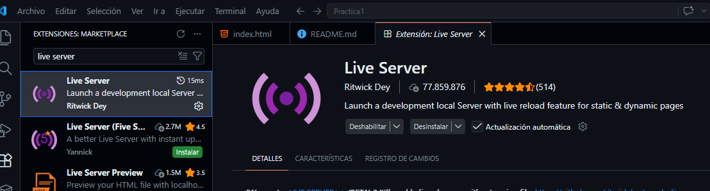
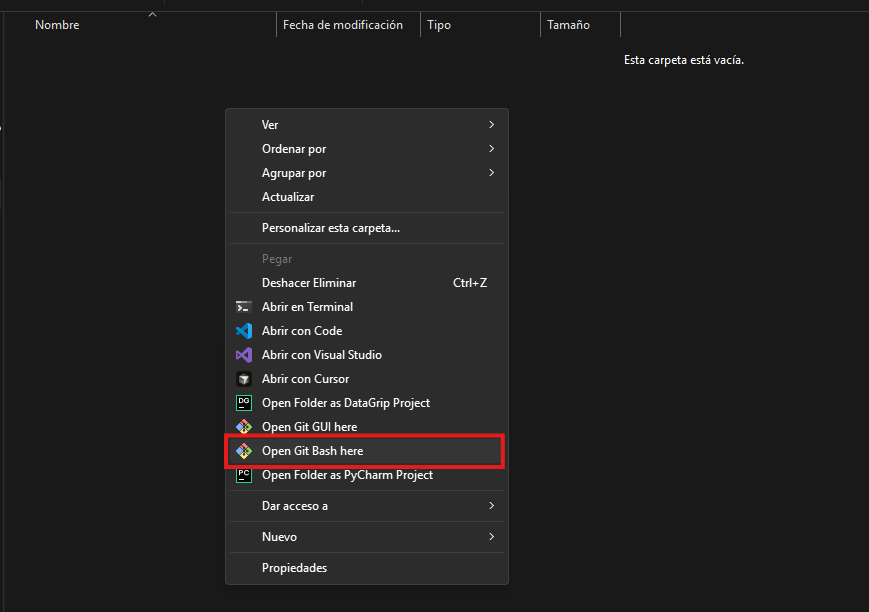
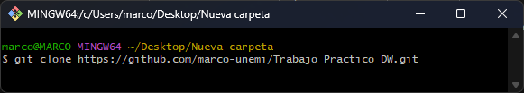
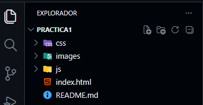
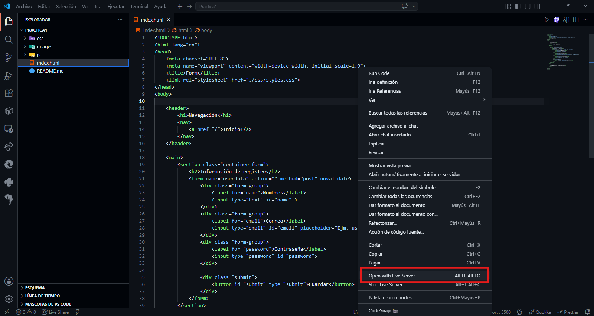
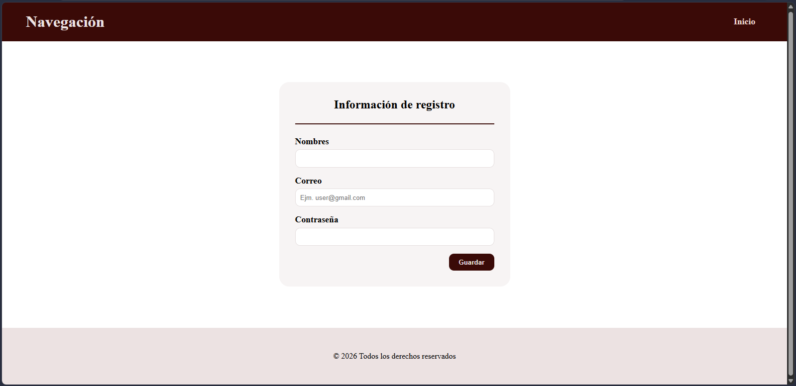

# Instalación y Ejecución

## Instalación de herramientas
**Instalar Git**
[git](https://git-scm.com/install/windows)

**Instalar Visual Studio Code**
[VSCode](https://code.visualstudio.com/download)

**Instalar la extension Live Server**
Ir a Extensiones en VScode, buscar "live server" e instalar la primera extension**


## Proceso de Ejecución
1. Crear una carpeta en la ruta de su preferencia.                                                  

2. Entrar a la carpeta, clic derecho, mas opciones y brir la terminal de Git bash.                                     


3. Clonar el repositorio por medio de git bash.                                                                               
```bash
git clone https://github.com/marco-unemi/Trabajo_Practico_DW.git
```


4. Entrar a VSCode y abrir la carpeta con el repositorio clonado.                                                       


5. Buscar el archivo **index.html**, darle clic derecho y seleccionar **Open with Live Server**.                                    


6. Resultado                                                                                                                            
